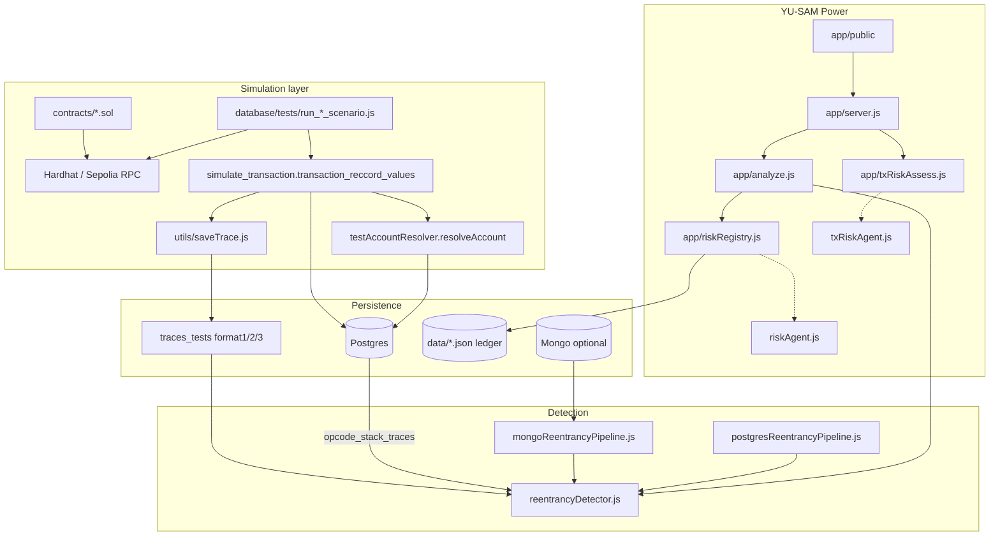
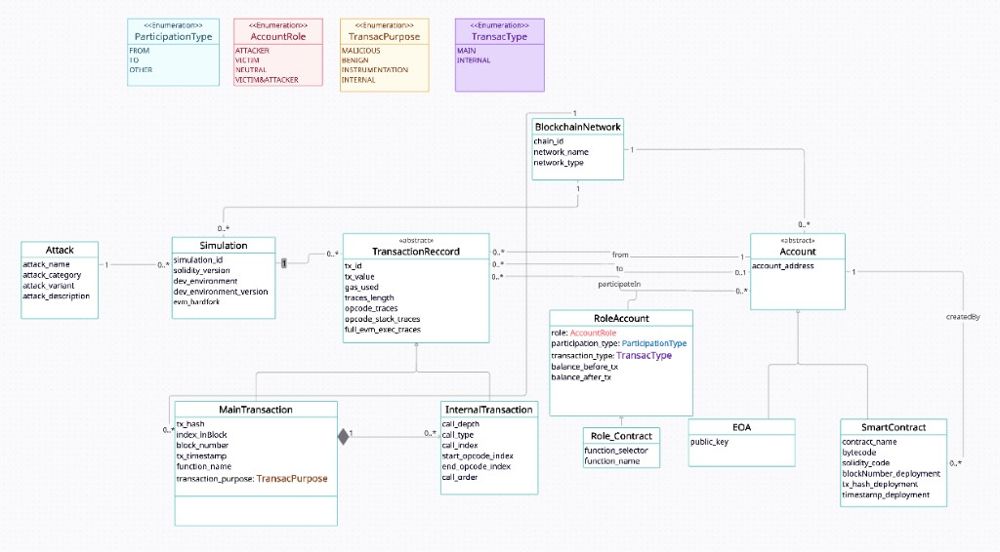

<p align="center">
  
</p>

# YU-SAM Power — Single-Function Reentrancy Simulator & Detector

Hardhat lab + analyzer product for **simulating**, **recording**, and **detecting** single-function reentrancy on Ethereum-style execution traces.

**Live app:** [https://yu-sam-power.fly.dev/](https://yu-sam-power.fly.dev/)

- **Simulate** vulnerable and guarded banks with attacker contracts (Hardhat / Sepolia).
- **Persist** accounts, transactions, and opcode traces in **Postgres** (optional **Mongo** bulk scan).
- **Detect** reentrancy with an EFG-style algorithm on **format2** traces.
- **Operate** via the **YU-SAM Power** UI: analyze txs, maintain a risk registry, optional AI briefings, pre-tx risk (human CONTINUE/ABORT).

> Scope: validated for **single-function, single-contract, single-transaction** reentrancy. Not cross-function / cross-contract / read-only reentrancy / multi-tx patterns.

---

## Table of contents

1. [Architecture](#1-architecture)
2. [Repository layout](#2-repository-layout)
3. [Database schema & storage](#3-database-schema--storage) — includes [UML class diagram](#uml-class-diagram-simulator)
4. [saveTrace — three trace formats](#4-savetrace--three-trace-formats)
5. [resolveAccount — finding account addresses](#5-resolveaccount--finding-account-addresses)
6. [Transaction record — what we save](#6-transaction-record--what-we-save)
7. [Detection algorithm](#7-detection-algorithm)
8. [AI agents](#8-ai-agents)
9. [YU-SAM Power app (UI & API)](#9-yu-sam-power-app-ui--api)
10. [Requirements](#10-requirements)
11. [Run the simulator](#11-run-the-simulator)
12. [Test each part](#12-test-each-part)
13. [Environment variables](#13-environment-variables)

---

## 1. Architecture



**Data flow (simulation):** deploy/attack → `debug_traceTransaction` → `saveTrace` (files) + `resolveAccount` (DB accounts) → `main_transaction` / `internal_transaction` / `role_account`.

**Data flow (analysis):** format2 text (file, paste, RPC, or DB) → detector → optional registry update → optional AI briefing.

---

## 2. Repository layout

| Path | Role |
|------|------|
| `contracts/` | Vulnerable banks, CEI/mutex/OZ guards, attackers |
| `scripts/` | Deploy helpers and scenario utilities |
| `utils/saveTrace.js` | Fetch & write format1 / format2 / format3 |
| `database/schema/` | Postgres DDL |
| `database/repositories/` | CRUD for accounts, txs, roles, Etherscan |
| `database/scripts/` | `simulate_transaction`, `resolveAccount`, detector, pipelines |
| `database/tests/` | Malicious / safe Hardhat scenario runners |
| `traces_tests/` | Fixture traces (`full/*-format2.txt` preferred for detection) |
| `app/` | YU-SAM Power server, analyze, registry, AI, static UI |
| `data/` | Runtime JSON registry + pre-tx decisions (Fly volume → `/data`) |

---

## 3. Database schema & storage

### UML class diagram (simulator)

Conceptual model of the attack simulation database: attacks → simulations → main/internal transactions, accounts (EOA / smart contract), and per-tx roles.

<p align="center">
  
</p>

### Which store is used where?

| Concern | Primary store |
|---------|----------------|
| Simulation dataset (accounts, txs, full traces) | **PostgreSQL** |
| UI risk registry & pre-tx decisions | **JSON** under `YU_SAM_DATA_DIR` or `data/` |
| Optional registry mirror | Postgres `vulnerable_contract` / `contract_exploit` |
| Historical bulk scan | **MongoDB** (`geth.transaction` style) — optional |

Connection: `database/db.js` using `DB_HOST`, `DB_PORT`, `DB_NAME`, `DB_USER`, `DB_PASSWORD`.

### Simulation schema (`database/schema/attack_simulation_schema.sql`)

**Enums**

- `participation_type_enum`: `FROM` | `TO` | `OTHER`
- `account_role_enum`: `ATTACKER` | `VICTIM` | `NEUTRAL` | `VICTIM_AND_ATTACKER`
- `transaction_purpose_enum`: `MALICIOUS` | `BENIGN` | `INSTRUMENTATION` | `INTERNAL`
- `transac_type_enum`: `MAIN` | `INTERNAL`

**Tables (overview)**

| Table | Purpose |
|-------|---------|
| `blockchain_network` | `chain_id`, network name/type |
| `Attack` | Named attack catalog (`attack_name` PK) |
| `Simulation` | One sim run: Solidity/env/hardfork + FK to network & attack |
| `Account` | PK `(account_address, chain_id)` |
| `EOA` | EOA extension (+ optional `publicKey`) |
| `SmartContract` | Bytecode, source (if known), deploy meta, creator FK |
| `main_transaction` | Top-level tx + three trace columns |
| `internal_transaction` | Internal calls linked to a main tx |
| `role_account` | Per-tx account roles, balances, selector |

**`main_transaction` fields of interest**

- Identity: `tx_hash`, `chain_id`, `simulation_id`
- Tx meta: `tx_value`, `block_number`, `index_inBlock`, `tx_timestamp`, `tx_status`, `gas_used`, `transaction_purpose`
- Traces: `traces_length`, `opcode_traces` (format1), `opcode_stack_traces` (format2), `full_evm_exec_traces` (format3 JSONB)
- Parties: `from_address` / `to_address` (+ chain FKs)

**`internal_transaction`:** `call_order`, `call_depth`, `call_type`, opcode index range, value/gas, same three trace columns, from/to.

**`role_account`:** `participation_type`, `role_account`, `balance_before_tx` / `balance_after_tx`, `function_selector`.

Apply:

```bash
psql "$DB_NAME" -f database/schema/attack_simulation_schema.sql
psql "$DB_NAME" -f database/schema/vulnerable_contract_registry.sql
```

### Risk registry schema (`database/schema/vulnerable_contract_registry.sql`)

| Table | Role |
|-------|------|
| `vulnerable_contract` | Aggregated risk per `(contract_address, chain_id)`: stolen wei, exploit count, max reentrancy, attackers, `risk_score` / `risk_level`, `risk_factors` JSONB |
| `contract_exploit` | One row per detected exploit tx: stolen, reentrancy count, selector, attackers, `detection_detail` |

### Runtime JSON (`data/` or Fly `/data`)

- `vulnerable_contract_registry.json` — UI ledger (primary for the product)
- `tx_risk_decisions.json` — pre-tx assessments & human CONTINUE/ABORT decisions

### Mongo (optional pipeline)

- Source: `MONGO_DB` (default `geth`) / `MONGO_COLLECTION` (default `transaction`)
- Results: `MONGO_RESULTS_COLLECTION` (default `reentrancy_detection_results`)

---

## 4. saveTrace — three trace formats

**File:** `utils/saveTrace.js`

Fetches a full structLog via RPC:

```js
ethers.provider.send("debug_traceTransaction", [txHash, {
  disableMemory: false, disableStack: false, disableStorage: false
}])
```

Then writes three artifacts under `outputDir` with prefix `filePrefix`:

| Format | File | Content |
|--------|------|---------|
| **format1** | `*-format1.txt` | `pc;OP` per line |
| **format2** | `*-format2.txt` | `pc;OP;` + **reversed** stack (comma-joined hex) — **detector input** |
| **format3** | `*-format3.json` | Full `debug_traceTransaction` JSON |

Returns `{ trace, format1, format2, format3, opcodeCount }`.

UI/RPC path reuses the same convention via `app/traceFormat2.js` (`fetchFormat2ViaProvider`).

---

## 5. resolveAccount — finding account addresses

**File:** `database/scripts/testAccountResolver.js`  
**Function:** `resolveAccount(accountAddress, chainId, scontractName?)`

Ensures every from/to (and internal call party) exists in Postgres before inserting txs.

### Steps

1. **Validate** — `ethers.isAddress`; provider `chainId` must match the argument (correct `--network`).
2. **Normalize** — EIP-55 checksum (`getAddress`) so casing does not create duplicate rows.
3. **Lookup** — `findAccount` in Postgres; if present, return.
4. **Classify** — `getAccountType` (`getCode`): empty code → **EOA**, else **SMART_CONTRACT**.
5. **EOA** — single DB transaction: `createAccount` + `createEOA`.
6. **Contract** —
   - `fetchDeploymentInfoFromEtherscan` (`ETHERSCAN_API_KEY`) for source/deploy/creator
   - Recursively `resolveAccount(creator)` so the creator FK exists
   - `createAccount` + `createSmartContract`

Used from `transaction_reccord_values` for main from/to and each internal call’s from/to.

Smoke:

```bash
npx hardhat run database/scripts/testAccountResolver.js --network sepolia
```

---

## 6. Transaction record — what we save

**File:** `database/scripts/simulate_transaction.js`  
**Function:** `transaction_reccord_values(...)`

### Pipeline

1. Load tx + receipt + block timestamp from the provider.
2. `getOrCreateSimulation(attack_name)` → `simulationId`, `chainId`.
3. `resolveAccount` for `tx.from` and `tx.to || receipt.contractAddress`.
4. `saveTrace(...)` → formats + `opcodeCount`.
5. Detect internal calls from `structLogs` (`detectInternalCalls`).
6. `createMainTransaction` with purpose, traces, gas, value, parties.
7. `insertMainRoleAccounts` (`FROM` / `TO` roles, balances, selector).
8. If internals: slice traces per call, `resolveAccount` parties, `createInternalTransaction`.

### Values persisted (main)

| Field | Meaning |
|-------|---------|
| `tx_hash`, `chain_id` | Identity |
| `tx_value`, `gas_used`, `tx_status` | Outcome |
| `block_number`, `index_inBlock`, `tx_timestamp` | Ordering |
| `transaction_purpose` | `MALICIOUS` / `BENIGN` / `INSTRUMENTATION` / … |
| `opcode_traces` | format1 text |
| `opcode_stack_traces` | format2 text (used by detector & UI) |
| `full_evm_exec_traces` | format3 JSON |
| `simulation_id` | Links to Attack/Simulation catalog |
| from/to addresses | FK into `Account` |

Internal rows add call graph metadata (`call_order`, `call_depth`, `call_type`, opcode ranges) plus per-call traces.

---

## 7. Detection algorithm

**File:** `database/scripts/reentrancyDetector.js`  
**APIs:** `detectReentrancy(filePath)`, `detectReentrancyFromContent(text)`  
**CLI:**

```bash
node database/scripts/reentrancyDetector.js <path-to-format2.txt> [--json]
```

Always analyze **`full/*-format2.txt`** fixtures, not `internal/` fragments.

### EFG-style steps (as implemented)

1. Parse format2 → `{ pc, op, args[] }`.
2. **`buildNodes`** — split on `CALL*` / `CREATE*` / `STOP` / `RETURN` / `REVERT` / …
3. **`assignDepths`** — push on CALL-ending nodes, pop on terminators.
4. **`findRepeatedNodes`** — identical `pc:OP` sequences (length ≥ 2).
5. **`filterSplitCandidates`** — keep **p1** (start + CALL), **pmid** (resume + CALL), **p2** (resume + terminator).
6. **`groupByDepth`** + **`composeFunctions`** — stitch `p1 → (pmid)* → p2` with PC continuity.
7. **`splitIntoChains`** — one chain per distinct p1 signature (victim vs attacker callback).
8. **`classify`** per chain:
   - Nesting: p1 index ↑ and p2 index ↓ with depth
   - Same p1 signature + same CALL **target**
   - CEI signal: p1 has **SLOAD**, p2 has **SSTORE**
   - Count reentries with **value > 0** after the outermost frame; sum drained wei
   - `victimContract`, `attackerAddress`, `functionSelector` derived from CALL / calldata patterns

### Verdicts & outputs

| Field | Description |
|-------|-------------|
| `verdict` | `REENTRANCY_DETECTED` \| `NOT_REENTRANT` \| `INCONCLUSIVE` |
| `reason` | Set when inconclusive / not reentrant |
| `reentrancyCount` | Value-bearing reentries beyond outermost |
| `totalInvocationsFound` | Frames in the chain |
| `victimContract` | Contract entered via CALL |
| `attackerAddress` | Baseline CALL recipient (callback) |
| `functionSelector` | Extracted selector when available |
| `valuePerCallWei` / `totalDrainedWei` | Economic impact |
| `chains[]` / `primaryChainIndex` | Multiple repeated blocks; best value-bearing victim wins |

Batch:

- Postgres stored sims → `node database/scripts/postgresReentrancyPipeline.js`
- Mongo historical → `npm run mongo-scan` / `npm run mongo-scan:pilot`

---

## 8. AI agents

AI is **optional**. Deterministic scoring always runs; the LLM **critiques / narrates**, it does **not** replace the numeric score. Disabled with `RISK_AI_ENABLED=false`. On public deploy, also gated by `PUBLIC_AI`.

### Communication model

```text
UI / HTTP API
    → riskRegistry.js / txRiskAssess.js   (deterministic)
        → riskAgent.js / txRiskAgent.js   (direct require)
            → HTTPS fetch → OpenAI or Anthropic
                ← JSON briefing attached to response / stored on contract
```

No separate agent microservice — in-process modules called from the server.

### Agent A — Contract risk briefing (`app/riskAgent.js`)

| | |
|--|--|
| **When** | After a new exploit is recorded in the registry (`scheduleAiEnrichment` / assess endpoint) |
| **Input** | Registry contract object (address, chain, score, factors, exploit stats) + local “tools” (score breakdown, explorer links) |
| **Output** | `aiAssessment`: `headline`, `narrative`, `scoreAssessment`, action/gap lists, `confidence`, fingerprint |
| **Providers** | `OPENAI_API_KEY` or `ANTHROPIC_API_KEY` (`RISK_AI_PROVIDER`, models via `OPENAI_MODEL` / `ANTHROPIC_MODEL`) |

### Agent B — Pre-tx advisor (`app/txRiskAgent.js`)

| | |
|--|--|
| **When** | During `POST /api/tx-risk/assess` if AI enabled |
| **Input** | Deterministic assessment dossier (score, draft tx, ledger hits, on-chain hints) |
| **Output** | `headline`, `narrative`, `scoreEvaluation`, `whatCouldGoWrong`, `whyContinueMightBeOk`, `suggestedDecision` (`CONTINUE`\|`ABORT`\|`REVIEW`), `questionsForHuman`, `confidence` |
| **Constraint** | Does not broadcast transactions; human decides via `/api/tx-risk/decide` |

### Cursor agent (IDE only)

`.claude/agents/reentrancy-analyst.md` — instructs the IDE agent to run the detector CLI on format2 traces and report the same verdict structure. Not part of the HTTP runtime.

---

## 9. YU-SAM Power app (UI & API)

**Live app:** [https://yu-sam-power.fly.dev/](https://yu-sam-power.fly.dev/)

**Server:** `app/server.js`  
**Static UI:** `app/public/` (logo, analyzer tabs)  
**Default port:** `3857` (`PORT` / `ANALYZE_UI_PORT`)

### UI tabs

1. **Transaction hash** — load format2 from Postgres or RPC (`debug_traceTransaction`)
2. **Paste format2** — offline analysis
3. **JSON dataset** — batch rows with `opcode_stack_traces`
4. **Risk registry** — vulnerable contracts ledger + optional AI assess
5. **Pre-tx risk** — draft tx vs ledger → CONTINUE / ABORT

### Main HTTP routes

| Method | Path | Role |
|--------|------|------|
| `POST` | `/api/analyze` | Detect; on hit → `recordFromAnalysis` |
| `POST` | `/api/analyze-dataset` | Batch detect + registry updates |
| `GET` | `/api/registry` | List contracts |
| `GET` | `/api/registry/:chainId/:address` | Detail |
| `POST` | `/api/registry/:chainId/:address/ai-assess` | AI briefing |
| `GET` | `/api/registry/ai-status` | Whether AI is configured |
| `POST` | `/api/tx-risk/assess` | Pre-tx score (+ optional AI) |
| `POST` | `/api/tx-risk/decide` | Log CONTINUE / ABORT |
| `GET` | `/api/health` | Liveness + configured networks |

**Public mode** (`PUBLIC_MODE=true` or bind `0.0.0.0`): tighter rate limits; AI only if `PUBLIC_AI=true`.

**Production:** `npm start` → `app/startProduction.js` (no Hardhat; seeds empty `YU_SAM_DATA_DIR` from `data-seed`).  
**Deploy:** `Dockerfile`, `fly.toml` (volume `yu_sam_data` → `/data`), `render.yaml`.

---

## 10. Requirements

### Software

- **Node.js** ≥ 18
- **npm** (lockfile present)
- **Hardhat** toolchain (devDependency) for simulation & `analyze-ui`
- **PostgreSQL** for simulation recording / optional registry sync
- **MongoDB** only if you run `mongo-scan`
- An RPC that supports **`debug_traceTransaction`** for live tx-hash analysis (Alchemy/Infura-style archive/debug, or local geth)

### Optional

- `ETHERSCAN_API_KEY` — contract creator/source during `resolveAccount`
- `OPENAI_API_KEY` or `ANTHROPIC_API_KEY` — AI briefings
- Fly CLI — cloud deploy

### Install

```bash
git clone <this-repo>
cd reentrancy-attack
npm ci
cp .env   # create from your secrets; see Environment variables below
```

There is no committed `.env.example`; configure using the variable list in [§13](#13-environment-variables).

---

## 11. Run the simulator

### A. Analyzer UI (local, Sepolia via Hardhat)

```bash
npm run analyze-ui
# → http://localhost:3857
```

LAN / stricter public settings:

```bash
npm run analyze-ui:public
```

### B. Production-style server (no Hardhat)

```bash
npm start
```

Needs RPC env vars for tx-hash fetch; paste/dataset/registry work without them.

### C. Malicious / safe on-chain scenarios (Sepolia)

Requires funded key (`SEPOLIA_PRIVATE_KEY`), RPC, and Postgres.

```bash
# Full malicious suite
npx hardhat run database/tests/run_malicious_scenario.js --network sepolia

# One scenario
SCENARIO=vulnerable_single npx hardhat run database/tests/run_malicious_scenario.js --network sepolia

# Guarded / CEI / mutex suite
npx hardhat run database/tests/run_safe_scenario.js --network sepolia
```

These paths call `transaction_reccord_values` → `saveTrace` + `resolveAccount` + Postgres inserts, and write under `traces_tests/`.

### D. Detector only (offline)

```bash
node database/scripts/reentrancyDetector.js \
  traces_tests/reenAttack/malicious_scenario/attackCount_0-N/full/five_attack-format2.txt
```

### E. Pipelines

```bash
node database/scripts/postgresReentrancyPipeline.js
npm run mongo-scan:pilot   # limit 50, resume, JSON
npm run mongo-scan
```

### F. Contracts of interest

| Contract | Role |
|----------|------|
| `VulnerableBank.sol` | Classic withdraw-before-update |
| `BankCEI_Zero` / `BankCEI_Decrement` | Checks-effects-interactions |
| `BankBoolMutex` / `BankUintMutex` / `BankOZGuard` | Reentrancy guards |
| `AttackerConfigurable` / `attacker0-N` / drain variants | Attackers |

---

## 12. Test each part

| Component | How to test |
|-----------|-------------|
| **Detector (malicious)** | Point CLI at `traces_tests/reenAttack/malicious_scenario/**/full/*-format2.txt` → expect `REENTRANCY_DETECTED`, non-zero `reentrancyCount` / drained value where applicable |
| **Detector (safe)** | `traces_tests/reenAttack/safe_scenario/**/full/*-format2.txt` → `NOT_REENTRANT` or `INCONCLUSIVE`, no false `REENTRANCY_DETECTED` |
| **Instrumental traces** | `traces_tests/instrumental-func/full/` — deposit/getBalance style; should not flag as attack |
| **saveTrace** | `TX_HASH=0x… npx hardhat run utils/fetchTraceCli.js --network sepolia` (or project helpers under `utils/`) — confirm three files appear |
| **resolveAccount** | `npx hardhat run database/scripts/testAccountResolver.js --network sepolia` — EOA/contract rows in Postgres |
| **Full sim → DB** | Run one `SCENARIO=…` malicious script; query `main_transaction` / `role_account` / files under `traces_tests/` |
| **UI — tx hash** | Tab 1 with a hash already in DB or a debug-capable RPC |
| **UI — format2 paste** | Tab 2: paste contents of any `*-format2.txt` |
| **UI — dataset** | Tab 3: JSON array (or `{ "transactions": [...] }`) with `opcode_stack_traces` |
| **UI — registry** | Analyze a malicious fixture; open Tab 4 — contract appears with risk score |
| **UI — AI briefing** | Set API key, `RISK_AI_ENABLED` not false; registry → Assess (or `PUBLIC_AI=true` if public) |
| **UI — pre-tx risk** | Tab 5: draft `to` = known vulnerable registry address → score / recommendation → CONTINUE or ABORT |
| **Health** | `curl -s http://localhost:3857/api/health` |
| **Mongo pilot** | Configure `MONGO_*`, then `npm run mongo-scan:pilot` |
| **Postgres pipeline** | After sims exist: `postgresReentrancyPipeline.js` → `reentrancy_detection_results` |

> `npm test` is a stub and exits with an error. Use the scenarios and fixtures above.

---

## 13. Environment variables

Set in `.env` (never commit secrets). Names only:

| Group | Variables |
|-------|-----------|
| Postgres | `DB_HOST`, `DB_PORT`, `DB_NAME`, `DB_USER`, `DB_PASSWORD` |
| Sepolia RPC | `SEPOLIA_RPC_URL_PREMIUM`, `SEPOLIA_RPC_URL_PREIMUM` (legacy typo used in code), `SEPOLIA_RPC_URL_FREE`, `RPC_URL` |
| Mainnet RPC | `MAINNET_RPC_URL`, `ETH_MAINNET_RPC_URL`, `MAINNET_RPC_URL_PREMIUM`, `MAINNET_RPC_URL_FREE` |
| Keys | `SEPOLIA_PRIVATE_KEY`, `ETHERSCAN_API_KEY` |
| AI | `OPENAI_API_KEY`, `OPENAI_MODEL`, `OPENAI_BASE_URL`, `ANTHROPIC_API_KEY`, `ANTHROPIC_MODEL`, `RISK_AI_PROVIDER`, `RISK_AI_ENABLED`, `RISK_AI_TIMEOUT_MS` |
| UI / server | `PORT`, `ANALYZE_UI_PORT`, `ANALYZE_UI_HOST`, `PUBLIC_MODE`, `PUBLIC_AI`, `ANALYZE_UI_MAX_BODY_MB`, `ANALYZE_UI_RATE_*`, `ANALYZE_UI_DATASET_MAX_ROWS`, `YU_SAM_DATA_DIR` |
| Mongo | `MONGO_URI`, `MONGO_DB`, `MONGO_COLLECTION`, `MONGO_RESULTS_COLLECTION`, `SSH_HOST`, `MONGO_CONTAINER` |
| Scenarios | `TX_HASH`, `SCENARIO` |

Hardhat networks (`hardhat.config.js`): `hardhat`, `localhost` (31337), `sepolia` (11155111), `mainnet` (1). Solidity `0.8.28`.

---

## License

ISC (see `package.json`).
